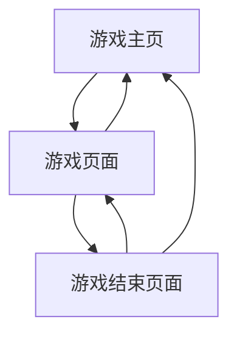

## 1. 产品概述
移动优先的贪吃蛇游戏，专为手机用户设计的经典街机游戏复刻版。
- 解决用户在移动端体验经典贪吃蛇游戏的需求，提供流畅的触控操作和现代化的游戏界面
- 目标用户为喜欢休闲游戏的移动端用户，特别是怀念经典游戏的用户群体

## 2. 核心功能

### 2.1 用户角色
无需用户注册，所有用户均为游客身份，可直接开始游戏

### 2.2 功能模块
贪吃蛇游戏包含以下主要页面：
1. **游戏主页**：游戏标题、开始游戏按钮、游戏说明、最高分显示
2. **游戏页面**：游戏画布、分数显示、暂停按钮、返回主页按钮
3. **游戏结束页面**：最终得分、重新开始按钮、返回主页按钮、本次游戏时长

### 2.3 页面详情
| 页面名称 | 模块名称 | 功能描述 |
|---------|---------|---------|
| 游戏主页 | 游戏标题区 | 显示游戏标题和精美的贪吃蛇图标 |
| 游戏主页 | 最高分展示区 | 显示历史最高分记录 |
| 游戏主页 | 开始游戏按钮 | 点击后进入游戏页面 |
| 游戏主页 | 游戏说明区 | 显示游戏操作说明和规则 |
| 游戏页面 | 游戏画布 | 显示贪吃蛇、食物、障碍物，支持触控操作 |
| 游戏页面 | 分数显示 | 实时显示当前得分和已吃食物数量 |
| 游戏页面 | 游戏控制 | 暂停/继续游戏，返回主页 |
| 游戏结束页面 | 得分总结 | 显示最终得分、最高分对比、游戏时长 |
| 游戏结束页面 | 重新开始 | 立即开始新游戏 |
| 游戏结束页面 | 返回主页 | 返回游戏主页 |

## 3. 核心流程
用户操作流程：
1. 用户进入游戏主页，查看游戏说明和最高分
2. 点击开始游戏按钮进入游戏页面
3. 通过触控操作（滑动或虚拟摇杆）控制蛇的移动
4. 蛇吃到食物后增长并得分，游戏速度逐渐加快
5. 蛇撞到边界或自身时游戏结束
6. 查看得分总结，选择重新开始或返回主页

## 4. 用户界面设计

### 4.1 设计风格
- **主色调**：深绿色（#2E7D32）和浅绿色（#4CAF50），营造经典贪吃蛇氛围
- **按钮样式**：圆角矩形，绿色渐变背景，白色文字，触控时有按压效果
- **字体**：无衬线字体，主标题24px，正文16px，小字12px
- **布局风格**：全屏游戏画布，简洁的HUD界面，卡片式信息展示
- **图标风格**：扁平化设计，使用emoji或简约线条图标

### 4.2 页面设计概述
| 页面名称 | 模块名称 | UI元素 |
|---------|---------|---------|
| 游戏主页 | 游戏标题区 | 深绿色背景，白色"贪吃蛇"文字，蛇形emoji装饰 |
| 游戏主页 | 最高分展示区 | 卡片式设计，绿色边框，显示皇冠图标和分数 |
| 游戏主页 | 开始游戏按钮 | 大型绿色按钮，白色"开始游戏"文字，触控反馈 |
| 游戏页面 | 游戏画布 | 黑色背景，绿色网格线，蛇和食物使用鲜明对比色 |
| 游戏页面 | 分数显示 | 顶部半透明黑色条，白色数字，实时更新 |
| 游戏页面 | 游戏控制 | 底部按钮组，暂停和主页图标按钮 |
| 游戏结束页面 | 得分总结 | 卡片式弹窗，显示得分详情和游戏统计 |
| 游戏结束页面 | 操作按钮 | 并排的两个按钮，重新开始和返回主页 |

### 4.3 响应式设计
- **移动优先**：针对手机屏幕优化，支持320px以上宽度
- **触控优化**：按钮最小44px触控区域，滑动操作识别
- **自适应布局**：游戏画布根据屏幕尺寸自动调整，保持正方形比例
- **横竖屏适配**：支持竖屏和横屏模式，自动调整UI布局