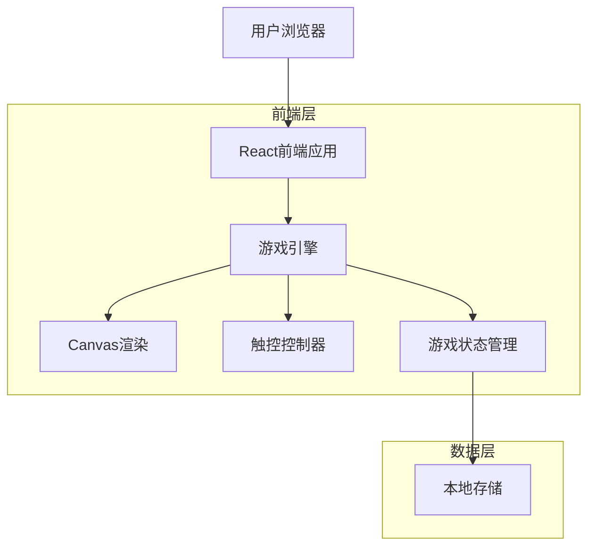
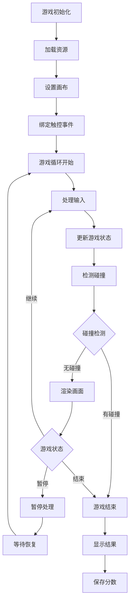

## 1. 架构设计



## 2. 技术描述

- **前端**: React@18 + TypeScript + Vite
- **初始化工具**: vite-init
- **样式**: TailwindCSS@3 + CSS Modules
- **游戏引擎**: 自定义Canvas游戏引擎
- **触控控制**: Hammer.js (手势识别)
- **状态管理**: React Hooks (useState, useEffect, useReducer)
- **本地存储**: localStorage (最高分记录)
- **后端**: 无后端服务，纯前端应用

## 3. 路由定义

| 路由 | 用途 |
|-------|---------|
| / | 游戏主页，显示游戏标题、最高分和开始按钮 |
| /game | 游戏页面，主要的游戏画布和控制界面 |
| /game-over | 游戏结束页面，显示得分和重新开始选项 |

## 4. 核心组件架构

### 4.1 游戏引擎组件
```typescript
interface GameEngine {
  canvas: HTMLCanvasElement;
  ctx: CanvasRenderingContext2D;
  gameState: GameState;
  snake: Snake;
  food: Food;
  score: number;
  isRunning: boolean;
  
  init(): void;
  start(): void;
  pause(): void;
  resume(): void;
  gameOver(): void;
  update(): void;
  render(): void;
}
```

### 4.2 游戏状态管理
```typescript
interface GameState {
  status: 'idle' | 'playing' | 'paused' | 'gameOver';
  score: number;
  highScore: number;
  gameTime: number;
  snakeLength: number;
  speed: number;
}

interface Snake {
  body: Position[];
  direction: Direction;
  nextDirection: Direction;
  growCount: number;
}

interface Food {
  position: Position;
  type: 'normal' | 'special';
}

interface Position {
  x: number;
  y: number;
}

type Direction = 'up' | 'down' | 'left' | 'right';
```

### 4.3 触控控制接口
```typescript
interface TouchControls {
  onSwipe(direction: Direction): void;
  onTap(position: Position): void;
  enableVirtualJoystick(): void;
  disableVirtualJoystick(): void;
}
```

## 5. 游戏循环架构



## 6. 性能优化策略

### 6.1 渲染优化
- 使用 `requestAnimationFrame` 进行游戏循环
- 双缓冲技术减少画面闪烁
- 脏矩形检测，只重绘变化区域
- Canvas 尺寸动态调整，适配不同屏幕

### 6.2 内存管理
- 对象池复用，避免频繁创建销毁对象
- 及时清理事件监听器
- 使用 `WeakMap` 管理临时数据
- 避免内存泄漏的闭包使用

### 6.3 触控响应优化
- 使用 `passive: true` 提升滚动性能
- 防抖处理快速连续触控
- 预加载触控区域，减少点击延迟
- 支持多点触控和手势识别

## 7. 兼容性设计

### 7.1 浏览器兼容性
- 支持现代浏览器（Chrome 80+, Safari 12+, Firefox 75+）
- 渐进增强，不支持 Canvas 的浏览器显示降级提示
- 使用 Polyfill 处理新 API
- 响应式图片和字体加载

### 7.2 设备适配
- 支持 iOS 12+ 和 Android 8+
- 适配不同屏幕尺寸和分辨率
- 处理设备方向变化
- 优化电池使用，降低CPU占用